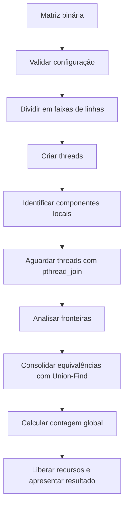
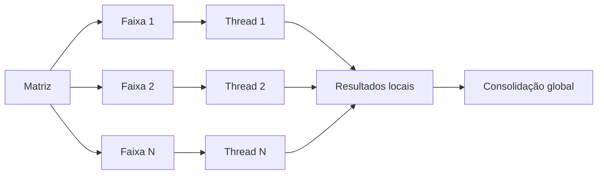
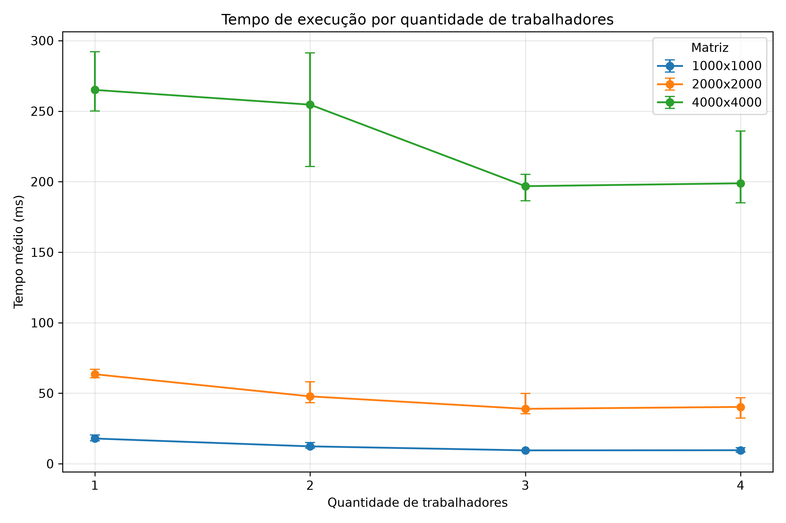
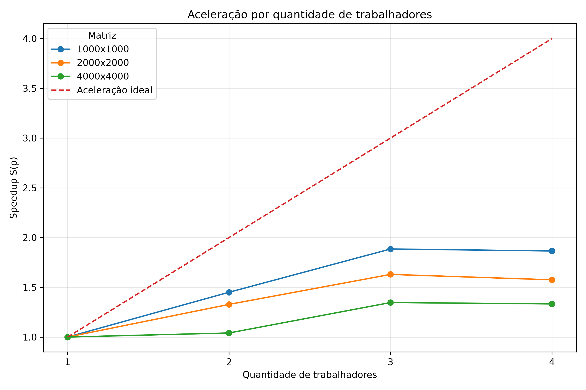
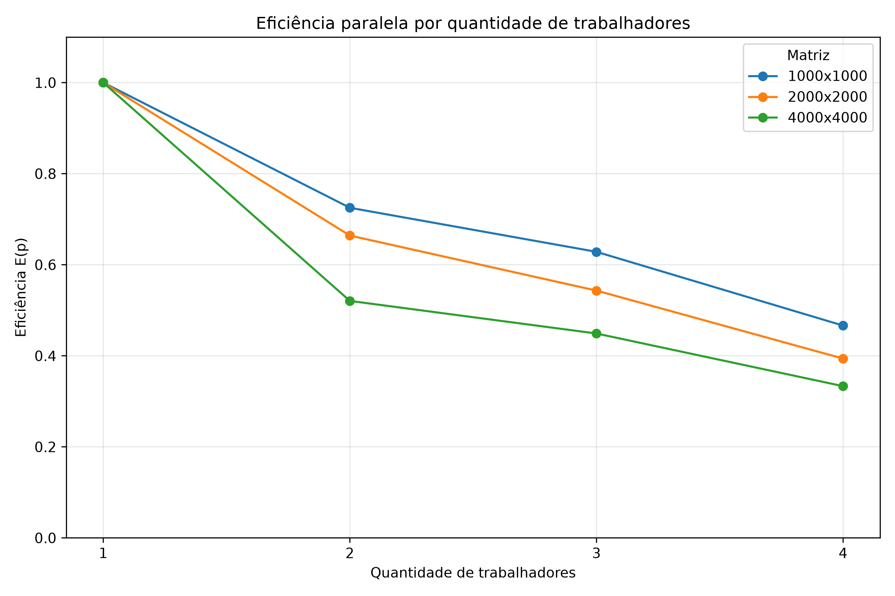

# Relatório técnico - Contagem paralela de objetos em uma matriz binária

> **Disciplina:** Sistemas Operacionais - 2026/II
> **Professor:** Prof. Filipo Novo Mór
> **Instituição:** Pontifícia Universidade Católica do Rio Grande do Sul - Escola Politécnica
> **Repositório:** [https://github.com/MRita011/T1-SO](https://github.com/MRita011/T1-SO)
> **Versão do relatório:** 1.0
> **Data:** 05/10/2026

## Identificação

| Campo | Informação |
|---|---|
| Integrante 1 | Maria Rita Rodrigues |
| Matrícula do integrante 1 | 23200079 |
| Integrante 2 | Mayra Bordin de Abreu |
| Matrícula do integrante 2 | 23112156 |
| Integrante 3 | Jully Anne Seyffert |
| Matrícula do integrante 3 | 23280111 |
| Integrante 4 | Gabriel Ribeiro Kowaleski |
| Matrícula do integrante 4 | 23112539 |
| Modalidade | grupo |
| Turma | 330 |
| Estratégia paralela | Pthreads |
| Plataforma testada | Linux - Ubuntu 26.04.1 LTS em ambiente WSL |
| Commit avaliado | `63c8ead` |

## Resumo

Este trabalho apresenta a implementação sequencial e paralela de um algoritmo para contagem de objetos em matrizes binárias utilizando conectividade 8. Na versão sequencial, a matriz é percorrida integralmente e cada novo componente é explorado por meio de Flood Fill iterativo com pilha explícita. Na versão paralela, a matriz é dividida estaticamente em faixas horizontais de linhas processadas por threads POSIX. Cada thread identifica e rotula os componentes existentes em sua região. Após a finalização das threads, os objetos que atravessam as fronteiras das regiões são consolidados por meio da estrutura Union-Find, preservando conexões verticais e diagonais entre regiões. As cinco matrizes obrigatórias produziram resultados idênticos nas versões sequencial e paralela, assim como os testes adicionais. Nos testes de desempenho com matrizes de até 4000x4000, todas as configurações paralelas da coleta final apresentaram aceleração em relação à versão sequencial, sendo três threads a configuração com melhor tempo médio nos três tamanhos avaliados.

**Palavras-chave:** sistemas operacionais; paralelismo; threads; conectividade 8; flood fill; componentes conexos; Union-Find.

## 1. Visão geral do problema

O programa recebe uma matriz binária na qual `0` representa o fundo e `1` representa o primeiro plano. Um objeto corresponde a um componente de células de valor `1` conectadas horizontalmente, verticalmente ou diagonalmente, conforme a **conectividade 8**.

O projeto contém duas implementações funcionalmente equivalentes:

1. uma versão sequencial, usada como referência de correção e de desempenho;
2. uma versão paralela baseada em Pthreads.

### 1.1 Objetivos da implementação

- Contar corretamente os objetos com conectividade 8.
- Distribuir trabalho efetivo entre pelo menos duas unidades de execução.
- Reconhecer e unificar objetos que atravessam as divisões da matriz.
- Produzir resultados determinísticos e idênticos nas versões sequencial e paralela.
- Evitar condições de corrida, deadlocks, atualizações perdidas e contagens duplicadas.
- Avaliar correção, sobrecarga, escalabilidade, aceleração e eficiência.

### 1.2 Requisitos atendidos

| Requisito | Como foi atendido | Evidência no repositório |
|---|---|---|
| ANSI C C89/C90 | O projeto é compilado com `-std=c89` e verificação adicional de avisos | [`Makefile`](Makefile) |
| Conectividade 8 | O Flood Fill verifica os oito vizinhos de cada célula | [`src/lib/flood-fill.c`](src/lib/flood-fill.c) |
| Versão sequencial | Implementação de referência utilizando Flood Fill iterativo | [`src/conta-objetos-sequencial.c`](src/conta-objetos-sequencial.c) e [`src/lib/contagem.c`](src/lib/contagem.c) |
| Versão paralela | Implementação baseada em Pthreads e faixas de linhas | [`src/conta-objetos-paralelo.c`](src/conta-objetos-paralelo.c) e [`src/lib/contagem.c`](src/lib/contagem.c) |
| Duas ou mais unidades concorrentes | A versão paralela foi testada com 2, 3 e 4 threads | [`src/conta-objetos-paralelo.c`](src/conta-objetos-paralelo.c) |
| Quantidade configurável de trabalhadores | O número de threads pode ser informado por argumento de linha de comando | `./paralelo 2`, `./paralelo 3` ou `./paralelo 4` |
| Consolidação entre regiões | As fronteiras são analisadas após a finalização das threads e equivalências são unificadas com Union-Find | [`src/lib/contagem.c`](src/lib/contagem.c) e [`src/lib/union-find.c`](src/lib/union-find.c) |
| Tratamento horizontal, vertical e diagonal | Conexões internas são tratadas pelo Flood Fill com conectividade 8; entre faixas são verificadas conexões verticais e diagonais | [`src/lib/flood-fill.c`](src/lib/flood-fill.c), [`src/lib/contagem.c`](src/lib/contagem.c) e teste adicional diagonal |
| Verificação das chamadas POSIX | Os retornos de `pthread_create`, `pthread_join` e `clock_gettime` são verificados | [`src/lib/contagem.c`](src/lib/contagem.c) e [`tests/teste-desempenho.c`](tests/teste-desempenho.c) |
| Liberação dos recursos | Memória dinâmica e estruturas auxiliares são liberadas nos fluxos tratados | [`src/lib/contagem.c`](src/lib/contagem.c) e [`src/lib/union-find.c`](src/lib/union-find.c) |
| Compilação reproduzível | O projeto possui alvos para compilar as versões sequencial, paralela e de desempenho | [`Makefile`](Makefile) |

## 2. Organização do repositório

```text
.
├── Makefile
├── README.md
├── RELATORIO_TECNICO.md
├── results/
│   ├── desempenho.md
│   ├── medicoes.csv
│   ├── grafico-tempo.png
│   ├── grafico-aceleracao.png
│   └── grafico-eficiencia.png
├── src/
│   ├── conta-objetos-sequencial.c
│   ├── conta-objetos-paralelo.c
│   └── lib/
│       ├── contagem.c
│       ├── contagem.h
│       ├── flood-fill.c
│       ├── flood-fill.h
│       ├── union-find.c
│       └── union-find.h
└── tests/
    ├── teste-desempenho.c
    └── gerar-graficos.py
```

A árvore acima representa a estrutura atual do repositório. Arquivos ainda não existentes, como os slides finais da apresentação, não foram listados.

| Caminho | Finalidade |
|---|---|
| [`src/conta-objetos-sequencial.c`](src/conta-objetos-sequencial.c) | Executa as matrizes obrigatórias na versão sequencial. |
| [`src/conta-objetos-paralelo.c`](src/conta-objetos-paralelo.c) | Executa as matrizes obrigatórias e os testes adicionais na versão paralela. |
| [`src/lib/contagem.c`](src/lib/contagem.c) | Contém as funções principais de contagem sequencial e paralela, criação das threads e consolidação das fronteiras. |
| [`src/lib/flood-fill.c`](src/lib/flood-fill.c) | Implementa o Flood Fill iterativo. |
| [`src/lib/union-find.c`](src/lib/union-find.c) | Implementa a estrutura Union-Find utilizada na consolidação. |
| [`tests/teste-desempenho.c`](tests/teste-desempenho.c) | Executa e registra as medições de desempenho. |
| [`tests/gerar-graficos.py`](tests/gerar-graficos.py) | Gera os gráficos a partir dos dados brutos. |
| [`results/medicoes.csv`](results/medicoes.csv) | Armazena os dados brutos das cinco repetições de cada configuração. |
| [`results/desempenho.md`](results/desempenho.md) | Apresenta a síntese e a análise das medições. |
| [`results/grafico-tempo.png`](results/grafico-tempo.png) | Gráfico dos tempos de execução. |
| [`results/grafico-aceleracao.png`](results/grafico-aceleracao.png) | Gráfico de aceleração. |
| [`results/grafico-eficiencia.png`](results/grafico-eficiencia.png) | Gráfico de eficiência paralela. |

## 3. Ambiente de desenvolvimento e execução

### 3.1 Hardware e software

| Item | Especificação |
|---|---|
| Processador | 11th Gen Intel(R) Core(TM) i5-1135G7 @ 2.40GHz |
| Núcleos físicos | 4 |
| Processadores lógicos | 8 |
| Memória RAM | 7,6 GiB |
| Sistema operacional | Ubuntu 26.04.1 LTS (Resolute Raccoon), executado em ambiente WSL |
| Arquitetura | x86_64 |
| Compilador | GCC 15.2.0 |
| Padrão da linguagem | C89/C90 |
| APIs POSIX utilizadas | Pthreads (`pthread_create`, `pthread_join`) e `clock_gettime(CLOCK_MONOTONIC, ...)` |
| Flags de compilação | `-std=c89 -Wall -Wextra -pedantic -pthread` |

Os testes foram executados em um processador Intel Core i5-1135G7, com quatro núcleos físicos e oito processadores lógicos. A implementação foi compilada com GCC 15.2.0 utilizando o padrão ANSI C89/C90.

A versão paralela utiliza POSIX Threads para criação e sincronização das threads. As medições de desempenho utilizam `clock_gettime` com `CLOCK_MONOTONIC`.

### 3.2 Compilação

Para remover binários de compilações anteriores e compilar todo o projeto:

```bash
make clean
make
```

Também é possível compilar individualmente:

```bash
make sequencial
make paralelo
make desempenho
```

Os executáveis produzidos são:

```text
sequencial
paralelo
desempenho
```

Para removê-los:

```bash
make clean
```

### 3.3 Execução

#### Versão sequencial

```bash
./sequencial
```

#### Versão paralela

Para executar todas as configurações previstas no programa:

```bash
./paralelo
```

Para escolher uma quantidade específica de threads:

```bash
./paralelo 2
./paralelo 3
./paralelo 4
```

#### Testes de desempenho

```bash
./desempenho
```

#### Geração dos gráficos

Com o ambiente Python configurado:

```bash
python tests/gerar-graficos.py
```

**Exemplo reproduzível:**

```bash
./sequencial
./paralelo 3
```

O primeiro comando executa as cinco matrizes obrigatórias utilizando a versão sequencial. O segundo executa as mesmas cinco matrizes utilizando três threads.

### 3.4 Formato da entrada e da saída

As matrizes utilizadas nos testes funcionais estão declaradas diretamente nos programas de teste. A implementação atual não recebe uma matriz por arquivo ou pela entrada padrão.

Na versão paralela, a quantidade de threads pode ser informada como argumento da linha de comando. Por exemplo:

```bash
./paralelo 3
```

Nesse caso, todas as matrizes obrigatórias são processadas utilizando três threads.

A saída apresenta uma tabela contendo:

- número da matriz;
- dimensão;
- quantidade de threads, quando aplicável;
- quantidade esperada de objetos;
- quantidade obtida;
- indicação `OK` ou `ERRO`.

Exemplo curto de saída:

```text
+--------+----------+---------+----------+--------+----------+
| Matriz | Dimensao | Threads | Esperado | Obtido | Status   |
+--------+----------+---------+----------+--------+----------+
| 1      |  5x5     | 3       | 3        | 3      | OK       |
+--------+----------+---------+----------+--------+----------+
```

## 4. Arquitetura da solução

### 4.1 Fluxo geral



### 4.2 Estruturas de dados principais

| Estrutura | Tipo/representação | Responsabilidade | Compartilhada? | Proteção utilizada |
|---|---|---|---|---|
| Matriz de entrada | `int *` | Armazenar `0` e `1` | Sim | Somente leitura durante a contagem |
| Células visitadas | `int *` | Marcar células processadas na versão sequencial | Não | Não se aplica |
| Rótulos | `int *` | Identificar componentes locais na versão paralela | Sim | Cada thread escreve apenas nas linhas de sua própria região |
| Pilha do Flood Fill | `int *` | Percorrer um componente de forma iterativa | Não | Uma pilha privada por contagem sequencial ou por thread |
| Regiões/tarefas | `ThreadArgs` | Armazenar limites da faixa e parâmetros de cada thread | Sim | Cada thread recebe um elemento próprio de `args` |
| Equivalências de rótulos | `UnionFind` com vetores `pai` e `tamanho` | Consolidar componentes que atravessam regiões | Não durante a fase paralela | Utilizada somente após os `pthread_join` |
| Resultados locais | `objetos_locais` em `ThreadArgs` | Armazenar a quantidade encontrada por cada thread | Sim | Cada thread altera somente seu próprio campo |

## 5. Implementação sequencial

### 5.1 Algoritmo

A versão sequencial percorre a matriz linha por linha. É criado um vetor `visitado`, inicialmente preenchido com zeros, e uma pilha explícita reutilizada durante os Flood Fills.

Para cada célula:

1. verifica-se se o valor da matriz é `1`;
2. verifica-se se a célula ainda não foi visitada;
3. quando ambas as condições são verdadeiras, um novo objeto é contado;
4. executa-se o Flood Fill a partir dessa célula;
5. todas as células conectadas são marcadas como visitadas.

O Flood Fill utiliza conectividade 8. Para cada célula processada, são verificadas as posições relativas:

```text
(-1,-1) (-1,0) (-1,+1)
( 0,-1)         ( 0,+1)
(+1,-1) (+1,0) (+1,+1)
```

O Flood Fill foi implementado de maneira **iterativa**, utilizando uma pilha explícita, evitando dependência da pilha de chamadas da linguagem.

### 5.2 Pseudocódigo

```text
FUNÇÃO contar_objetos_sequencial(matriz, linhas, colunas):

    criar vetor visitado preenchido com zero
    criar pilha
    objetos = 0

    PARA cada linha:
        PARA cada coluna:

            indice = posição da célula

            SE matriz[indice] == 1 E visitado[indice] == 0:
                objetos = objetos + 1

                marcar célula inicial como visitada
                inserir célula inicial na pilha

                ENQUANTO pilha não estiver vazia:
                    retirar uma célula da pilha

                    PARA cada um dos 8 vizinhos:
                        SE vizinho estiver dentro da matriz
                           E possuir valor 1
                           E ainda não estiver visitado:

                            marcar vizinho como visitado
                            inserir vizinho na pilha

    liberar estruturas
    RETORNAR objetos
```

### 5.3 Complexidade e uso de memória

Se `N = linhas × colunas`:

| Aspecto | Análise | Justificativa |
|---|---|---|
| Complexidade de tempo | `O(N)` | Cada célula é processada no máximo uma vez e cada processamento verifica até oito vizinhos |
| Complexidade de espaço | `O(N)` | São utilizados um vetor de visitados e uma pilha explícita |
| Risco de recursão excessiva | Não existe na versão final | O Flood Fill é iterativo e utiliza pilha explícita |

A pilha é alocada uma única vez por contagem sequencial e reutilizada durante o processamento dos diferentes objetos.

## 6. Implementação paralela

### 6.1 Modelo de concorrência

| Decisão | Escolha do grupo | Justificativa |
|---|---|---|
| Unidade de execução | Thread | Permite compartilhar a matriz e estruturas auxiliares no mesmo processo |
| Quantidade de trabalhadores | 2, 3 ou 4 threads | A quantidade pode ser configurada por argumento de linha de comando |
| Divisão do trabalho | Faixas horizontais de linhas | Divisão simples, determinística e sem sobreposição |
| Escalonamento | Estático | Cada thread recebe uma faixa antes da execução |
| Comunicação | Memória compartilhada | As threads pertencem ao mesmo processo |
| Sincronização | `pthread_join` e separação por fases | A consolidação somente começa depois do término das threads |

Não foram utilizados mutexes ou semáforos na fase de identificação local, pois cada thread escreve exclusivamente nas linhas pertencentes à sua região.

### 6.2 Decomposição da matriz

Para uma matriz com `linhas` linhas e `num_threads` trabalhadores, os limites de cada região são calculados por:

```c
linha_inicio = i * linhas / num_threads;
linha_fim = ((i + 1) * linhas / num_threads) - 1;
```

O número de regiões é sempre igual ao número de threads, pois cada thread recebe exatamente uma faixa. Portanto, nesta estratégia não existem mais regiões do que trabalhadores.

Quando o número de linhas não é divisível exatamente pela quantidade de threads, a fórmula de cálculo dos limites distribui as linhas restantes entre as faixas sem sobreposição e sem perda de linhas.

Exemplo para cinco linhas e duas threads:

```text
Thread 0 -> linhas 0 e 1
Thread 1 -> linhas 2, 3 e 4
```

Cada linha pertence a uma única thread. A função de contagem também rejeita uma quantidade de threads superior à quantidade de linhas da matriz.



### 6.3 Paralelismo efetivo

O cálculo efetivamente executado em paralelo é a identificação dos componentes existentes dentro de cada faixa da matriz.

Cada thread:

1. percorre suas próprias linhas;
2. identifica células com valor `1` ainda não rotuladas;
3. inicia um Flood Fill restrito à sua região;
4. atribui um rótulo ao componente;
5. registra sua quantidade de objetos locais.

O trabalho não consiste apenas na criação de threads: cada uma percorre e processa células distintas da matriz. O balanceamento é estático por número de linhas, de modo que as faixas possuem tamanhos próximos, embora a quantidade real de células pertencentes a objetos possa variar entre elas.

| Etapa | Sequencial ou paralela? | Unidade responsável | Motivo |
|---|---|---|---|
| Leitura/geração da matriz | Sequencial | Thread principal | Ocorre antes da contagem |
| Particionamento | Sequencial | Thread principal | Define os limites das regiões |
| Identificação local | Paralela | Threads trabalhadoras | As regiões podem ser processadas independentemente |
| Análise das fronteiras | Sequencial | Thread principal | Começa após os `pthread_join` |
| Consolidação | Sequencial | Thread principal | Union-Find é utilizada após a fase paralela |
| Contagem final | Sequencial | Thread principal | Combina contagens locais e uniões efetivas |

### 6.4 Sincronização, comunicação e regiões críticas

| Recurso/dado | Risco concorrente | Mecanismo usado | Escopo da proteção | Justificativa |
|---|---|---|---|---|
| Matriz de entrada | Leitura simultânea | Nenhum bloqueio | Toda a matriz | A matriz não é modificada pelas threads |
| Vetor de rótulos | Condição de corrida em escritas | Particionamento exclusivo por linhas | Faixa de cada thread | Nenhuma célula pertence a duas regiões |
| `ThreadArgs` | Atualização concorrente | Elemento exclusivo por thread | `args[i]` | Cada thread modifica apenas seus próprios campos |
| Union-Find | Atualizações concorrentes | Separação por fases | Consolidação global | A estrutura só é usada depois que todas as threads terminam |

A solução não utiliza múltiplos mutexes ou semáforos e, por isso, não existe uma ordem de aquisição de bloqueios capaz de produzir deadlock.

A principal sincronização ocorre por meio de `pthread_join`. A fase de consolidação só começa depois que todas as threads de identificação local terminaram.

## 7. Consolidação dos componentes

A soma simples das contagens locais pode produzir resultado incorreto, pois um único objeto pode atravessar a fronteira entre duas regiões e ser identificado temporariamente como dois componentes locais distintos.

### 7.1 Identificação local

Cada novo componente local recebe como rótulo:

```c
rotulo = indice + 1;
```

Como cada célula possui um índice global único na matriz, esse valor produz identificadores distintos para componentes iniciados em posições distintas. O valor zero permanece reservado para indicar célula ainda não rotulada.

Cada thread executa o Flood Fill limitado à sua própria faixa de linhas. Assim, um objeto que atravessa duas regiões recebe, inicialmente, rótulos diferentes em cada região.

### 7.2 Verificação das fronteiras

A decomposição adotada utiliza **faixas horizontais de linhas**.

Para cada par de regiões consecutivas são comparadas:

- a última linha da região superior;
- a primeira linha da região inferior.

Para cada célula com valor `1` da linha superior são verificadas três posições na linha inferior:

```text
coluna - 1
coluna
coluna + 1
```

| Situação | Pares de células verificados | Como a equivalência é registrada |
|---|---|---|
| Fronteira horizontal | Última linha da faixa superior com primeira linha da faixa inferior | Union-Find |
| Fronteira vertical | Não se aplica à decomposição escolhida por faixas horizontais | Não se aplica |
| Conexão diagonal | Coluna anterior e coluna seguinte na linha da região vizinha | `uf_union` |
| Encontro de quatro blocos | Não se aplica à decomposição por faixas horizontais | Não se aplica |

As conexões horizontais entre células da mesma região são tratadas normalmente pelo Flood Fill local. Nas fronteiras entre regiões, a posição de mesma coluna preserva a conexão vertical e as posições `coluna - 1` e `coluna + 1` preservam as conexões diagonais.

### 7.3 Unificação e contagem global

Depois dos `pthread_join`, é criada uma estrutura Union-Find, representada pelos vetores `pai` e `tamanho`.

A operação `uf_find` identifica o representante de um conjunto. A operação `uf_union` une dois conjuntos quando eles ainda são distintos.

Quando uma união realmente conecta dois componentes anteriormente separados, `uf_union` retorna `1`. Caso os componentes já pertençam ao mesmo conjunto, retorna `0`.

Primeiramente é calculada a soma das contagens locais:

```text
total_local =
    objetos da thread 0 +
    objetos da thread 1 +
    ... +
    objetos da thread N
```

Depois são contabilizadas apenas as uniões efetivas encontradas nas fronteiras:

```text
total_global = total_local - unioes
```

Como `uf_union` contabiliza apenas uniões entre conjuntos anteriormente distintos, subtrair o número de uniões efetivas da quantidade de componentes locais é equivalente a determinar a quantidade final de conjuntos, ou representantes distintos, após a consolidação.

A estrutura Union-Find é utilizada apenas depois da finalização de todas as threads, portanto não exige sincronização adicional entre trabalhadores.

### 7.4 Exemplo rastreável

A matriz obrigatória 2 possui dimensão 6x8 e resultado esperado igual a quatro objetos.

Considerando a execução com duas threads:

```text
Thread 0 -> linhas 0, 1 e 2
Thread 1 -> linhas 3, 4 e 5
```

Antes da consolidação, a primeira região identifica dois componentes e a segunda identifica três:

```text
total_local = 2 + 3 = 5
```

Um dos componentes da região superior é iniciado na célula de índice 9, recebendo o rótulo `10`. Na região inferior, o componente correspondente é iniciado na célula de índice 27, recebendo o rótulo `28`.

Na fronteira entre as regiões, esses componentes possuem células conectadas e são reconhecidos como equivalentes:

```text
10 ≡ 28
```

A primeira união entre esses conjuntos é efetiva:

```text
total_local = 5
unioes = 1
total_global = 5 - 1 = 4
```

Resultado final:

```text
4 objetos
```

| Região | Rótulo local | Células de fronteira relevantes | Equivalência global |
|---|---:|---|---|
| Superior - linhas 0 a 2 | 10 | Células do componente que alcançam a última linha da faixa | `10 ≡ 28` |
| Inferior - linhas 3 a 5 | 28 | Células do componente que iniciam na primeira linha da faixa | `28 ≡ 10` |

Os demais componentes não apresentam conexão entre as duas regiões e permanecem independentes.

## 8. Correção e testes funcionais

### 8.1 Procedimento de validação

As saídas foram comparadas diretamente com a quantidade esperada de objetos em cada matriz. Os próprios programas de teste exibem `OK` quando o valor obtido corresponde ao esperado e `ERRO` em caso contrário.

A implementação paralela foi executada com:

```text
2 threads
3 threads
4 threads
```

Além das cinco matrizes obrigatórias, foram criados testes adicionais para:

- uma matriz somente com zeros;
- um único objeto atravessando três regiões;
- uma conexão diagonal atravessando uma fronteira.

Nos testes de desempenho, cada configuração foi repetida cinco vezes. A quantidade de objetos encontrada em cada repetição também foi comparada com o resultado de referência, e os dados foram registrados em [`results/medicoes.csv`](results/medicoes.csv).

### 8.2 Matrizes obrigatórias

| Exemplo | Dimensões | Objetos esperados | Resultado sequencial | Resultado paralelo | Trabalhadores | Situação | Evidência |
|---:|---:|---:|---:|---|---|---|---|
| 1 | 5 x 5 | 3 | 3 | 3 em todas as configurações | 2, 3 e 4 | Aprovado | [`src/conta-objetos-sequencial.c`](src/conta-objetos-sequencial.c) e [`src/conta-objetos-paralelo.c`](src/conta-objetos-paralelo.c) |
| 2 | 6 x 8 | 4 | 4 | 4 em todas as configurações | 2, 3 e 4 | Aprovado | [`src/conta-objetos-sequencial.c`](src/conta-objetos-sequencial.c) e [`src/conta-objetos-paralelo.c`](src/conta-objetos-paralelo.c) |
| 3 | 8 x 8 | 5 | 5 | 5 em todas as configurações | 2, 3 e 4 | Aprovado | [`src/conta-objetos-sequencial.c`](src/conta-objetos-sequencial.c) e [`src/conta-objetos-paralelo.c`](src/conta-objetos-paralelo.c) |
| 4 | 9 x 12 | 6 | 6 | 6 em todas as configurações | 2, 3 e 4 | Aprovado | [`src/conta-objetos-sequencial.c`](src/conta-objetos-sequencial.c) e [`src/conta-objetos-paralelo.c`](src/conta-objetos-paralelo.c) |
| 5 | 12 x 12 | 7 | 7 | 7 em todas as configurações | 2, 3 e 4 | Aprovado | [`src/conta-objetos-sequencial.c`](src/conta-objetos-sequencial.c) e [`src/conta-objetos-paralelo.c`](src/conta-objetos-paralelo.c) |

### 8.3 Casos de teste adicionais

| ID | Dimensões | Característica avaliada | Resultado de referência | Configurações paralelas | Resultado obtido | Situação |
|---|---:|---|---:|---|---:|---|
| A1 | 4 x 4 | Matriz somente com zeros | 0 | 2 threads | 0 | Aprovado |
| A2 | 6 x 4 | Um único objeto ocupando três regiões | 1 | 3 threads | 1 | Aprovado |
| A3 | 4 x 4 | Conexão diagonal atravessando a fronteira | 1 | 2 threads | 1 | Aprovado |
| A4 | 4000 x 4000 | Matriz grande usada no desempenho | 724346 | 2, 3 e 4 threads | 724346 | Aprovado |

### 8.4 Repetibilidade e determinismo

| Teste | Repetições | Configurações | Resultados idênticos? | Observações |
|---|---:|---|---|---|
| Matrizes obrigatórias | 1 por combinação funcional | Sequencial, 2, 3 e 4 threads | Sim | Todas produziram os valores esperados |
| Matriz 1000x1000 | 5 por configuração | Sequencial, 2, 3 e 4 threads | Sim | 45472 objetos em todas as execuções |
| Matriz 2000x2000 | 5 por configuração | Sequencial, 2, 3 e 4 threads | Sim | 181340 objetos em todas as execuções |
| Matriz 4000x4000 | 5 por configuração | Sequencial, 2, 3 e 4 threads | Sim | 724346 objetos em todas as execuções |

## 9. Avaliação de desempenho

### 9.1 Metodologia experimental

| Parâmetro | Valor adotado |
|---|---|
| Matriz ou conjunto de matrizes | 1000x1000, 2000x2000 e 4000x4000, com aproximadamente 30% de células de valor `1`, geradas deterministicamente pelo programa de teste |
| Mesmos dados em todas as versões? | Sim. Para cada dimensão, a matriz é gerada uma vez e reutilizada nas versões sequencial e paralela |
| Relógio/API de medição | `clock_gettime(CLOCK_MONOTONIC, ...)` |
| Trecho medido | Chamada da função de contagem sequencial ou paralela; a geração da matriz não faz parte do intervalo medido |
| Aquecimentos descartados | Não foram realizados descartes específicos |
| Repetições por configuração | 5 |
| Medida representativa | Média aritmética |
| Critério para dispersão | Intervalo mínimo-máximo |
| Carga do sistema durante os testes | Não controlada formalmente; medições realizadas no mesmo ambiente WSL |
| Flags de otimização | Não foi utilizada `-O2`; compilação com `-std=c89 -Wall -Wextra -pedantic -pthread` |

As medições brutas estão disponíveis em [`results/medicoes.csv`](results/medicoes.csv).

A matriz de desempenho é preenchida por uma regra determinística presente em [`tests/teste-desempenho.c`](tests/teste-desempenho.c), permitindo que as versões sequencial e paralela sejam comparadas sobre os mesmos dados em cada tamanho.

### 9.2 Métricas

A aceleração para `p` trabalhadores é calculada por:

$$

S(p) = \frac{T_{sequencial}}{T_{paralelo}(p)}

$$

A eficiência paralela é calculada por:

$$

E(p) = \frac{S(p)}{p}

$$

### 9.3 Resultados consolidados

#### Matriz 1000x1000

| Versão | Trabalhadores (`p`) | Tempo representativo (ms) | Dispersão (ms) | Aceleração `S(p)` | Eficiência `E(p)` | Resultado correto? |
|---|---:|---:|---:|---:|---:|---|
| Sequencial | 1 | 17.890 | 16.319 - 20.442 | 1.00 | 1.00 | Sim |
| Paralela | 2 | 12.336 | 11.190 - 15.041 | 1.45 | 0.73 | Sim |
| Paralela | 3 | 9.491 | 9.361 - 9.671 | 1.89 | 0.63 | Sim |
| Paralela | 4 | 9.591 | 8.335 - 11.413 | 1.87 | 0.47 | Sim |

#### Matriz 2000x2000

| Versão | Trabalhadores (`p`) | Tempo representativo (ms) | Dispersão (ms) | Aceleração `S(p)` | Eficiência `E(p)` | Resultado correto? |
|---|---:|---:|---:|---:|---:|---|
| Sequencial | 1 | 63.465 | 60.904 - 66.935 | 1.00 | 1.00 | Sim |
| Paralela | 2 | 47.781 | 43.299 - 58.032 | 1.33 | 0.66 | Sim |
| Paralela | 3 | 38.945 | 35.523 - 49.799 | 1.63 | 0.54 | Sim |
| Paralela | 4 | 40.287 | 32.459 - 46.855 | 1.58 | 0.39 | Sim |

#### Matriz 4000x4000

| Versão | Trabalhadores (`p`) | Tempo representativo (ms) | Dispersão (ms) | Aceleração `S(p)` | Eficiência `E(p)` | Resultado correto? |
|---|---:|---:|---:|---:|---:|---|
| Sequencial | 1 | 265.057 | 250.119 - 292.157 | 1.00 | 1.00 | Sim |
| Paralela | 2 | 254.603 | 210.847 - 291.411 | 1.04 | 0.52 | Sim |
| Paralela | 3 | 196.809 | 186.442 - 205.183 | 1.35 | 0.45 | Sim |
| Paralela | 4 | 198.839 | 184.956 - 235.890 | 1.33 | 0.33 | Sim |

### 9.4 Dados brutos das repetições

#### Matriz 1000x1000

| Versão | Trabalhadores | Repetição 1 (ms) | Repetição 2 (ms) | Repetição 3 (ms) | Repetição 4 (ms) | Repetição 5 (ms) | Medida representativa (ms) |
|---|---:|---:|---:|---:|---:|---:|---:|
| Sequencial | 1 | 20.442 | 18.051 | 18.153 | 16.319 | 16.486 | 17.890 |
| Paralela | 2 | 15.041 | 11.935 | 11.190 | 11.856 | 11.659 | 12.336 |
| Paralela | 3 | 9.361 | 9.394 | 9.671 | 9.449 | 9.580 | 9.491 |
| Paralela | 4 | 8.335 | 8.491 | 11.413 | 11.334 | 8.382 | 9.591 |

#### Matriz 2000x2000

| Versão | Trabalhadores | Repetição 1 (ms) | Repetição 2 (ms) | Repetição 3 (ms) | Repetição 4 (ms) | Repetição 5 (ms) | Medida representativa (ms) |
|---|---:|---:|---:|---:|---:|---:|---:|
| Sequencial | 1 | 66.935 | 66.759 | 61.243 | 61.482 | 60.904 | 63.465 |
| Paralela | 2 | 58.032 | 44.226 | 43.299 | 46.648 | 46.700 | 47.781 |
| Paralela | 3 | 37.072 | 35.835 | 35.523 | 36.496 | 49.799 | 38.945 |
| Paralela | 4 | 46.855 | 46.827 | 32.459 | 37.665 | 37.628 | 40.287 |

#### Matriz 4000x4000

| Versão | Trabalhadores | Repetição 1 (ms) | Repetição 2 (ms) | Repetição 3 (ms) | Repetição 4 (ms) | Repetição 5 (ms) | Medida representativa (ms) |
|---|---:|---:|---:|---:|---:|---:|---:|
| Sequencial | 1 | 292.157 | 262.574 | 267.102 | 250.119 | 253.336 | 265.057 |
| Paralela | 2 | 291.411 | 264.113 | 249.245 | 257.400 | 210.847 | 254.603 |
| Paralela | 3 | 192.891 | 186.442 | 205.183 | 196.141 | 203.388 | 196.809 |
| Paralela | 4 | 235.890 | 197.156 | 184.956 | 186.586 | 189.606 | 198.839 |

Os valores completos, com maior precisão decimal, estão armazenados em [`results/medicoes.csv`](results/medicoes.csv).

### 9.5 Gráfico de tempo de execução



**Figura 1 -** Tempo de execução da versão sequencial e das configurações paralelas. As barras de erro representam o intervalo entre o menor e o maior tempo observado nas cinco repetições. Fonte: elaborado pelo grupo.

### 9.6 Gráfico de aceleração



**Figura 2 -** Aceleração observada em função da quantidade de trabalhadores. A linha ideal corresponde a `S(p) = p`. Fonte: elaborado pelo grupo.

### 9.7 Gráfico de eficiência



**Figura 3 -** Eficiência paralela em função da quantidade de trabalhadores. Fonte: elaborado pelo grupo.

### 9.8 Análise dos resultados

A versão paralela apresentou resultado funcional idêntico ao da versão sequencial em todas as configurações avaliadas.

Na matriz 1000x1000, o melhor desempenho foi obtido com três threads, com tempo médio de 9.491 ms e speedup de 1.89. Na matriz 2000x2000, três threads novamente apresentaram o melhor resultado, com 38.945 ms e speedup de 1.63. Na matriz 4000x4000, a configuração com três threads obteve média de 196.809 ms e speedup de 1.35.

Assim, três threads apresentaram o menor tempo médio nos três tamanhos avaliados. A utilização de quatro threads não produziu ganho adicional em relação a três threads.

Esse comportamento mostra que aumentar a quantidade de trabalhadores não implica aceleração proporcional. A eficiência diminuiu à medida que o número de threads aumentou. Na matriz 4000x4000, por exemplo:

```text
2 threads -> eficiência 0.52
3 threads -> eficiência 0.45
4 threads -> eficiência 0.33
```

Entre os fatores que podem limitar a escalabilidade estão:

- custo de criação e finalização das threads;
- acesso concorrente à memória e comportamento de cache;
- distribuição desigual da carga real entre faixas com a mesma quantidade de linhas;
- inicialização e uso da estrutura Union-Find;
- análise sequencial das fronteiras;
- consolidação sequencial;
- demais trechos que permanecem sequenciais.

Na coleta final, todas as configurações paralelas apresentaram `S(p) > 1`. Portanto, não houve caso final de versão paralela mais lenta que a sequencial. Ainda assim, a redução da eficiência com o aumento do número de threads evidencia a presença de sobrecargas e de partes sequenciais que limitam a escalabilidade.

## 10. Tratamento de erros e qualidade do código

### 10.1 Chamadas e recursos POSIX

| Chamada/recurso | Erro verificado? | Ação em caso de falha | Liberação/finalização |
|---|---|---|---|
| `pthread_create` | Sim | Interrompe novas criações e aguarda as threads já criadas | `pthread_join` nas threads criadas antes da liberação dos recursos compartilhados |
| `pthread_join` | Sim | Registra a falha e continua tentando aguardar as demais threads | Se não for possível garantir finalização segura, o processo é encerrado para evitar liberação insegura de memória compartilhada |
| `clock_gettime` | Sim | O teste de desempenho é interrompido | A matriz alocada é liberada antes do retorno |
| Mutex/semaforo | Não se aplica | Não utilizados | Não se aplica |
| Memória alocada (`malloc`/`calloc`) | Sim | A função retorna erro ou a thread registra falha em `ThreadArgs` | Recursos já alocados são liberados nos fluxos tratados |

As falhas de alocação da pilha local das threads são registradas no campo `erro` da estrutura `ThreadArgs`. Depois dos `pthread_join`, a thread principal verifica esse campo antes de iniciar a consolidação.

### 10.2 Compilação e análise

| Verificação | Comando/ferramenta | Resultado |
|---|---|---|
| Compilação C89/C90 | `make` | Compilação concluída sem erros |
| Avisos do compilador | `-Wall -Wextra -pedantic` | Nenhum aviso apresentado na versão validada |
| Vazamentos de memória | Não foi utilizada ferramenta dinâmica específica | Não verificado com Valgrind, Leaks ou sanitizer |
| Condições de corrida | Revisão da estratégia e testes funcionais | Não foi executado ThreadSanitizer ou Helgrind |

A ausência de ferramentas dinâmicas específicas de detecção de vazamentos ou condições de corrida deve ser considerada uma limitação da validação realizada.

A estratégia foi projetada para evitar escritas concorrentes sobre a mesma célula do vetor de rótulos: cada thread modifica somente as linhas pertencentes à sua própria região.

### 10.3 Separação de responsabilidades

O projeto separa as responsabilidades em módulos:

- [`src/conta-objetos-sequencial.c`](src/conta-objetos-sequencial.c): execução e apresentação dos testes sequenciais;
- [`src/conta-objetos-paralelo.c`](src/conta-objetos-paralelo.c): execução e apresentação dos testes paralelos e adicionais;
- [`src/lib/contagem.c`](src/lib/contagem.c): contagem, particionamento, criação das threads, sincronização e consolidação das fronteiras;
- [`src/lib/flood-fill.c`](src/lib/flood-fill.c): exploração iterativa dos componentes;
- [`src/lib/union-find.c`](src/lib/union-find.c): unificação de equivalências;
- [`tests/teste-desempenho.c`](tests/teste-desempenho.c): medição e geração dos dados brutos;
- [`tests/gerar-graficos.py`](tests/gerar-graficos.py): geração dos gráficos.

Essa organização separa processamento, concorrência, consolidação, medição e apresentação dos resultados.

## 11. Limitações e decisões de projeto

| Limitação ou decisão | Impacto | Alternativa considerada | Motivo da escolha |
|---|---|---|---|
| Divisão estática por faixas de linhas | Regiões com a mesma quantidade de linhas podem possuir cargas reais diferentes | Escalonamento dinâmico | Solução simples, determinística e sem sobreposição |
| Consolidação executada após as threads | Parte do algoritmo permanece sequencial | Consolidação paralela | Evita sincronização complexa sobre Union-Find |
| Union-Find dimensionado de acordo com a quantidade total de células | Utiliza memória proporcional ao tamanho da matriz | Estrutura somente para rótulos efetivamente utilizados | Simplifica o mapeamento entre células e identificadores |
| Testes executados em WSL | Tempos podem sofrer influência do ambiente virtualizado | Linux nativo | Ambiente disponível durante o desenvolvimento |
| Ausência de `-O2` | O desempenho não representa uma compilação otimizada | Comparar diferentes níveis de otimização | Mantém as flags centradas em compatibilidade e avisos do compilador |
| Matrizes funcionais declaradas no código | Não existe carregamento genérico de arquivo externo | Implementar leitura de arquivo | O foco do projeto é paralelismo, conectividade e consolidação |

## 12. Conclusão

O projeto alcançou o objetivo de implementar uma versão sequencial e uma versão paralela para a contagem de componentes conexos em matrizes binárias utilizando conectividade 8. A versão sequencial utiliza Flood Fill iterativo e produziu corretamente os resultados esperados nas cinco matrizes obrigatórias. A utilização de uma pilha explícita evitou o uso de recursão no Flood Fill e, consequentemente, o risco de crescimento excessivo da pilha de chamadas em componentes grandes.

Na implementação paralela, a matriz foi dividida em faixas horizontais processadas por threads POSIX. A identificação local dos componentes ocorre simultaneamente, enquanto a consolidação das fronteiras é realizada após a sincronização das threads. A estrutura Union-Find permite reconhecer componentes que receberam rótulos locais distintos, mas pertencem ao mesmo objeto global. Os testes com 2, 3 e 4 threads produziram os mesmos resultados da implementação sequencial, incluindo os casos adicionais de conexão diagonal, objeto atravessando três regiões e matriz zerada.

Os testes de desempenho mostraram aceleração em todas as configurações da coleta final, porém o ganho não cresceu proporcionalmente ao número de threads. Três threads apresentaram o melhor tempo médio nos três tamanhos de matriz. O principal aprendizado do projeto foi que paralelizar a identificação local não elimina os custos de criação, sincronização, acesso à memória e consolidação, e que essas sobrecargas influenciam diretamente a eficiência. Como melhoria futura, podem ser investigadas estratégias de balanceamento dinâmico e formas de reduzir o custo da estrutura de consolidação.

## 13. Vídeo de apresentação

| Campo | Informação |
|---|---|
| Plataforma | [YouTube / Vimeo] |
| Link privado ou não listado | https://youtu.be/RbMUUXoTZsU?is=qtn4_4U-1915kBvw |
| Duração | [MM:SS - máximo de 10 minutos] |
| Privacidade | [Não listado / privado compartilhado com o professor / protegido por senha] |
| Senha, se aplicável | [PREENCHER ou `Não se aplica`] |
| Data da última verificação do acesso | [DD/MM/AAAA] |

> **Importante:** o vídeo deve permanecer acessível ao professor durante todo o período de avaliação. No YouTube, um vídeo configurado como privado precisa ser explicitamente compartilhado com a conta indicada pelo professor; se essa conta não estiver disponível, use a opção **não listado**. No Vimeo, informe a senha no quadro acima quando houver proteção por senha. Teste o link em uma janela anônima antes da entrega.

### 13.1 Conteúdo do vídeo

- [ ] Problema e estratégia escolhida.
- [ ] Implementação sequencial e referência de correção.
- [ ] Decomposição, processos/threads e sincronização.
- [ ] Consolidação de objetos que atravessam regiões.
- [ ] Demonstração executável.
- [ ] Testes obrigatórios e adicionais.
- [ ] Resultados de desempenho.
- [ ] Conclusões.
- [ ] Participação de todos os integrantes do grupo.

## 14. Contribuições dos integrantes

| Atividade | Maria Rita | Mayra | Jully | Gabriel | Evidência/observação |
|---|---|---|---|---|---|
| Projeto da solução sequencial | [PREENCHER] | [PREENCHER] | [PREENCHER] | [PREENCHER] | [PREENCHER] |
| Projeto da solução paralela | [PREENCHER] | [PREENCHER] | [PREENCHER] | [PREENCHER] | [PREENCHER] |
| Sincronização/comunicação | [PREENCHER] | [PREENCHER] | [PREENCHER] | [PREENCHER] | [PREENCHER] |
| Consolidação | [PREENCHER] | [PREENCHER] | [PREENCHER] | [PREENCHER] | [PREENCHER] |
| Testes e medições | [PREENCHER] | [PREENCHER] | [PREENCHER] | [PREENCHER] | [PREENCHER] |
| Documentação e apresentação | [PREENCHER] | [PREENCHER] | [PREENCHER] | [PREENCHER] | [PREENCHER] |

Todos os integrantes declaram compreender integralmente o código, as estruturas de dados, a divisão do trabalho, a sincronização, a comunicação, a consolidação e os resultados apresentados.

## 15. Ferramentas, bibliotecas, referências e códigos externos

| Recurso | Finalidade | Origem/link | Licença, quando aplicável | Partes do projeto afetadas |
|---|---|---|---|---|
| POSIX Threads | Criação e sincronização das threads | POSIX / The Open Group | Não se aplica | Implementação paralela |
| GCC 15.2.0 | Compilação do código C | [https://gcc.gnu.org/](https://gcc.gnu.org/) | GPLv3+ | Compilação |
| Python 3.14.4 | Execução do script de geração dos gráficos | [https://www.python.org/](https://www.python.org/) | PSF License | Ferramentas de análise |
| Matplotlib 3.11.2 | Geração dos gráficos de desempenho | [https://matplotlib.org/](https://matplotlib.org/) | Licença do Matplotlib, baseada na PSF | [`tests/gerar-graficos.py`](tests/gerar-graficos.py) |
| Git | Controle de versão | [https://git-scm.com/](https://git-scm.com/) | GPLv2 | Histórico do projeto |
| GitHub | Hospedagem do repositório | [https://github.com/](https://github.com/) | Serviço externo | Repositório |
| ChatGPT | Apoio durante desenvolvimento, revisão, organização dos testes e documentação | [https://chatgpt.com/](https://chatgpt.com/) | Não se aplica | Sugestões de código, testes, organização e documentação, posteriormente compiladas, executadas e adaptadas pelo grupo |

As sugestões fornecidas por ferramentas externas foram verificadas por compilação, execução dos testes funcionais e comparação entre os resultados das versões sequencial e paralela.

## 16. Checklist de entrega

### Código e execução

- [x] O código segue ANSI C C89/C90.
- [x] O projeto compila em Linux ou macOS.
- [x] A compilação ocorre sem erros e os avisos foram tratados ou justificados.
- [x] As principais chamadas POSIX têm os retornos verificados.
- [x] Todos os recursos são finalizados ou liberados corretamente nos fluxos tratados.
- [x] A versão sequencial conta componentes com conectividade 8.
- [x] A versão paralela distribui cálculo real entre pelo menos duas unidades.
- [x] A quantidade de processos/threads é configurável.
- [x] Conexões horizontais, verticais e diagonais são preservadas.
- [x] Componentes que atravessam regiões são consolidados sem duplicidade.
- [x] Não há condições de corrida, deadlocks ou atualizações perdidas conhecidas.

### Testes e desempenho

- [x] As cinco matrizes obrigatórias foram executadas nas duas versões.
- [x] A versão paralela produziu exatamente os mesmos resultados da sequencial.
- [x] Foi criada pelo menos uma matriz maior para o teste de desempenho.
- [x] Foram testadas pelo menos duas quantidades de processos/threads.
- [x] As medições foram repetidas e o valor representativo foi explicado.
- [x] Tempo sequencial, tempo paralelo, aceleração e eficiência foram informados.
- [x] Resultados em que a versão paralela foi mais lenta foram explicados. Na coleta final, não houve configuração com `S(p) < 1`.
- [x] Dados brutos, tabelas e gráficos estão versionados no repositório.

### Repositório e apresentação

- [ ] O repositório do GitHub está público.
- [x] `README.md` contém descrição, autoria, compilação, execução e arquitetura.
- [x] O `Makefile` ou as instruções equivalentes permitem compilação reproduzível.
- [x] As matrizes de teste e seus resultados estão incluídos.
- [x] A análise de desempenho está incluída.
- [ ] Os slides estão em `slides/apresentacao.pdf`.
- [ ] O link do vídeo está acessível e o vídeo tem até 10 minutos.
- [x] Ferramentas, referências, bibliotecas e códigos externos foram identificados.
- [x] O hash do commit avaliado foi registrado neste relatório.

## Apêndice A - Registro de comandos

```bash
# Informações do ambiente
lscpu
free -h
cat /etc/os-release
uname -m
gcc --version

# Compilação
make clean
make

# Execução dos testes obrigatórios
./sequencial
./paralelo
./paralelo 2
./paralelo 3
./paralelo 4

# Execução dos testes de desempenho
./desempenho

# Geração dos gráficos
source .venv/bin/activate
python tests/gerar-graficos.py
```

## Apêndice B - Formato dos dados brutos

O arquivo [`results/medicoes.csv`](results/medicoes.csv) adota o seguinte cabeçalho:

```csv
matriz,linhas,colunas,versao,trabalhadores,repeticao,tempo_ms,objetos,resultado_correto
```

Exemplo do formato:

```csv
1000x1000,1000,1000,sequencial,1,1,20.441...,45472,true
1000x1000,1000,1000,paralela,2,1,15.040...,45472,true
```

## Apêndice C - Correspondência com os critérios de avaliação

| Critério | Peso | Seções com evidências |
|---|---:|---|
| Correção sequencial e paralela, incluindo conectividade 8 | 2,0 | 5, 6, 7 e 8 |
| Decomposição do problema e paralelismo efetivo | 1,5 | 6.1, 6.2 e 6.3 |
| Sincronização, comunicação e ausência de condições de corrida | 1,5 | 6.4 e 10 |
| Consolidação de objetos que atravessam regiões | 1,5 | 7 |
| Testes obrigatórios, adicionais e análise de desempenho | 1,0 | 8 e 9 |
| Qualidade do código ANSI C e tratamento de erros | 1,0 | 3 e 10 |
| Organização do repositório e documentação | 0,5 | 2, 3 e 16 |
| Apresentação, demonstração e domínio da implementação | 1,0 | 13 e 14 |
